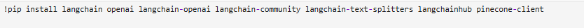
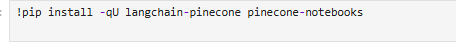
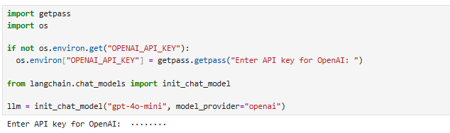
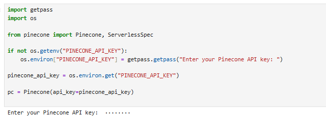
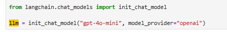
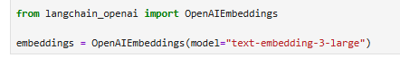
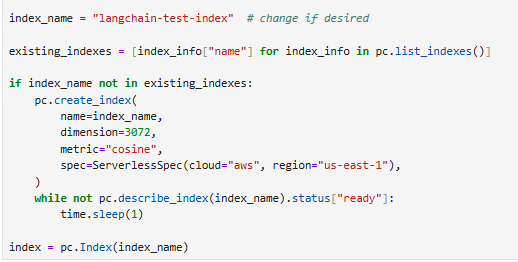
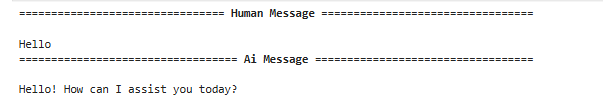
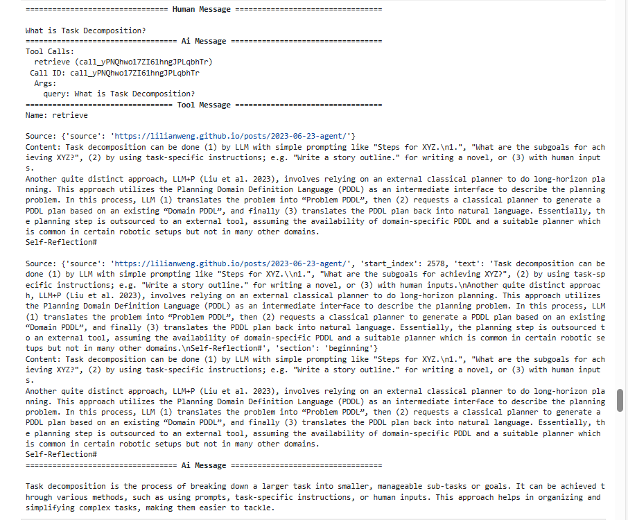
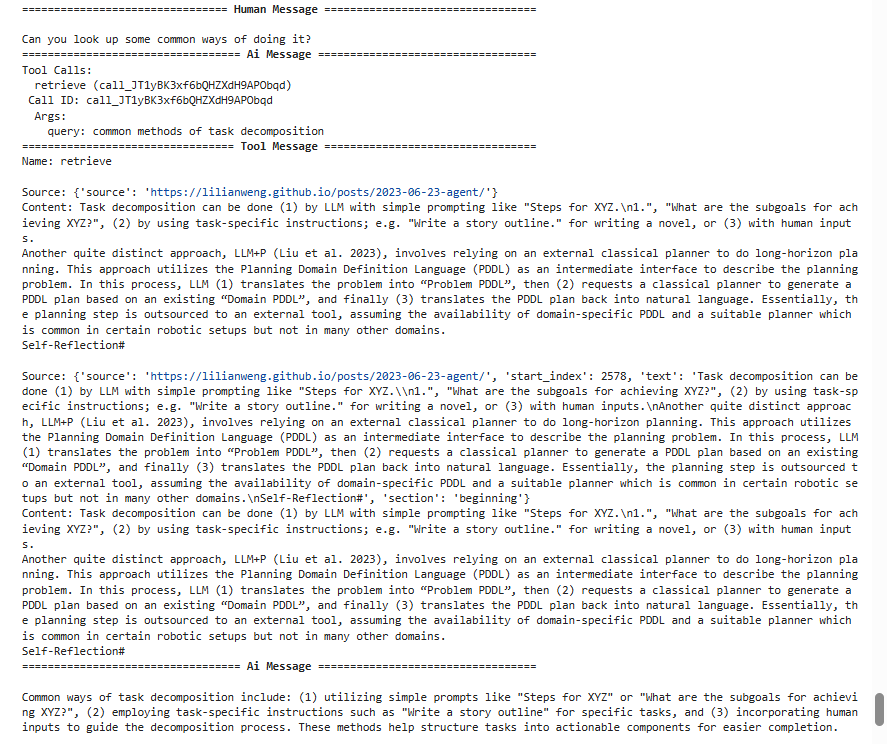

# Lab08---AREP-RAG

## Resumen 
Este proyecto implementa un **sistema RAG (Retrieval-Augmented Generation)** utilizando **LangChain**, **Pinecone** y **OpenAI**, ejecutado desde **Jupyter Notebook**.  
El objetivo es crear un pipeline que permita:
1. Vectorizar documentos (texto, noticias, tweets, etc.).
2. Almacenarlos en una base de datos vectorial (**Pinecone**).
3. Consultar información de manera semántica y generar respuestas enriquecidas usando **GPT-4o-mini**.

## Instalación

No es necesario instalar nada fuera de jupyter o incluso solo tener instalado python y ejecutar todo el codigo que aparece en el notebook.

NOTA: Es necesario contar con keys funcionales de Openai y Pinecone

## Estructura del proyecto

Se instalan las librerias necesarias para la construcción del RAG, siendo por ejemplo necesarias langchain, pinecone y OpenAI.

Como se mencionó previamente en necesario contar con Keys válidas de OpenAI y Pinecone

### Modelo LLM

### Embeddings

### Pinecone

## Ejemplos del funcionamiento

## Built With

* [OpenIA](https://platform.openai.com/api-keys)
* [PineCone](https://platform.openai.com/api-keys)
* [Jupyter](https://jupyter.org)

## Authors

* **Santiago Córdoba Dueñas**  - [Santiago Córdoba](https://github.com/Santiago-Cordoba)